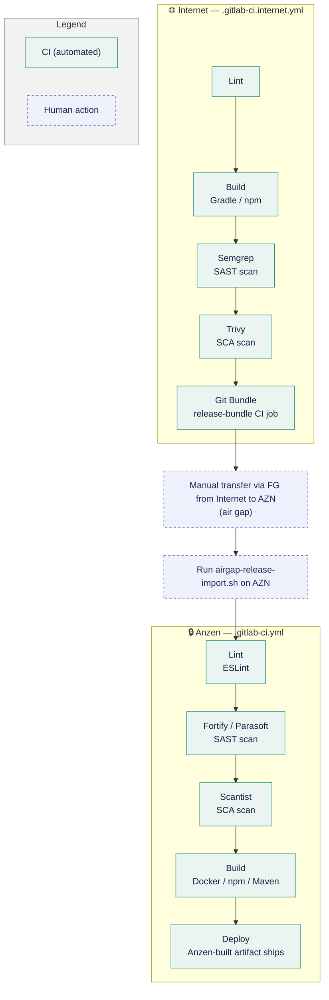

# Internet–AZN Git Sync

*Correct as of 20 September 2026*


---

## 1. Version Control & Security Scanning: AZN vs Internet

Scanning on Internet runs on free/OSS substitutes in place of AZN's paid enterprise stack.

| Area | AZN (On-Prem) | Internet | 
| --- | --- | --- | 
| Version control | GitLab Premium | GitLab Free* | 
| Lint | ESLint | ESLint | 
| SAST | Fortify, Parasoft | Semgrep CE | 
| SCA | Scantist | Trivy | 
| Artifact / container registry | JFrog | GitLab Package/Container Registry | 

*capped at 5 seats, alternatives being evaluated

**What Lint, SAST and SCA are:**
- **Lint (ESLint)** checks code style and structure — catching formatting issues, unused variables, and common bug patterns — as source code is written. It's a code-quality check, not a security scan, and runs alongside SAST/SCA in CI.
- **SAST (Static Application Security Testing)** scans your own source code — without running it — to catch security bugs like injection flaws, hardcoded secrets, or unsafe API usage before the code ships.
- **SCA (Software Composition Analysis)** scans your third-party dependencies (npm/Maven packages, base images, etc.) against known vulnerability databases (CVEs) to catch risky or outdated libraries you've pulled in.

---
 
## 2. Synchronization Methodology & Workflow

> [!NOTE] Core strategy: one-way downstream sync only (Internet → AZN)
> - Code is developed and reviewed on Internet, then pulled into AZN at release time. 
> - No reverse sync exists — AZN never pushes code back to Internet.
 
Each repo now carries **two CI config files**: `.gitlab-ci.internet.yml` (runs on Internet, online) and `.gitlab-ci.yml` (runs on AZN, offline).
 



>[!WARNING]  ⚠️ **Open question:** pls update the mermaid diagram above with the correct ci jobs
 
**What `airgap-release-import.sh` does:** 
- verifies the bundle, commit, and tag validity
- merges and fast-forwards the validated release into the AZN repository 
 
>[!WARNING]  ⚠️ **Open question:** is `airgap-release-import.sh` repo-agnostic across all 19 repos, or does each repo need its own config? 
 
### Why the Git Trees Look Different
 
Internet carries full branch history. AZN stays a linear, read-only mirror advanced only by verified fast-forward merges.
 
**Internet — full branching:**
```
main
├── feature/*        (active dev)
├── release/v1.4     (release prep)
└── tags: v1.4.0     (triggers release-bundle)
```
 
**AZN — linear mirror only:**
```
main
└── fast-forward only
      (no feature branches,
       no local commits)
```
 
AZN only ever receives fast-forwarded commits from a verified bundle — it never grows its own branches. Internet keeps the full feature/release model needed for day-to-day development and review.
 
### Final Release Process
 
Versioning is decided on Internet (git tag `v*`) — the artifact that actually ships is always the one rebuilt fresh on AZN, never the one built during Internet CI.
 
>[!WARNING]  ⚠️ **Open question:**using `standard-version` for all repos?
 
 
---
 
## 3. Migration & Run-Config Differences Required
 
Internet-side repos need environment-specific tweaks so builds don't depend on AZN-only infrastructure.
 
| Area | Internet-side change | Why |
| --- | --- | --- |
| CI pipeline config | Separate `.gitlab-ci.internet.yml`, not the shared `ci-templates` include | AZN's `ci-templates` can't resolve outside the internal network |
| Backend (`build.gradle` / Testcontainers) | Tests run with `-x test` (skipped) | Testcontainers needs a privileged/dind Docker daemon the Internet runner lacks |
| Docker / docker-compose | Internal registry hostnames replaced or parameterized via `.env` toggles in `webcore-compose` | Internet runners can't resolve internal DNS (`jfrog.dev.saf`) |
| Frontend (`.npmrc` / `package-lock.json`) | Internal `jfrog.dev.saf` registry URLs auto-stripped by the bootstrap import script | Prevents leaking internal hostnames into Internet git history |
 
>[!WARNING]  ⚠️ **Open question:** I dont have access to internet gitlab now nor the claude artifact used to go through the internet dev stuff -- pls fill in where people can find the internet migration guides for `build.gradle`, `docker-compose`, and `.npmrc`. Intention is coz some config methodology stuff can share with other projects, not unique to gc3.
 
---
 
## 4. Current Progress
 
>[!WARNING] ⚠️ **Open question:** pls help confirm the info below then we can un-strike the below statement :(

~~GC3 is fully developing on internet now.~~

| Category | % Done | Status |
| --- | --- | --- |
| Frontend / MFEs | 100% | All migrated |
| Backend microservices | 20% | In progress — `cet-service`, `webcore-kafka-example` still outstanding |
| Shared Java libraries | 0% | No Internet publish pipeline yet — still outstanding |
| Infra & internal tooling | 100% |  All migrated |

>[!WARNING]  ⚠️ **Open question:** help confirm the above info pls
