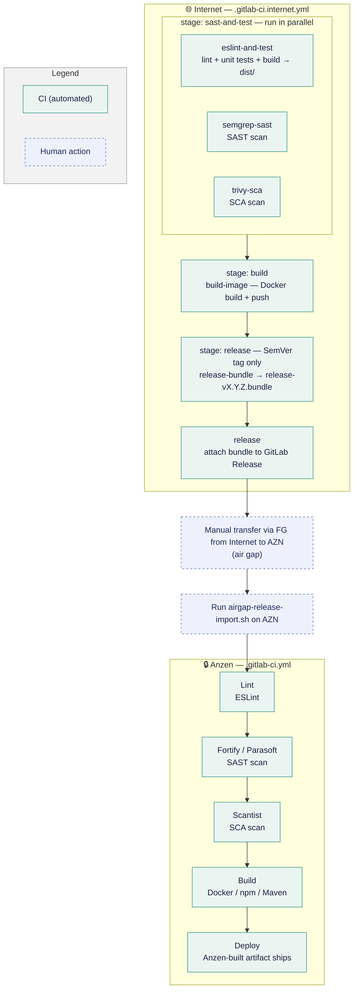

# Internet–AZN Git Sync

*Correct as of 20 September 2026*


---

## 1. Version Control & Security Scanning: AZN vs Internet

Scanning on Internet runs on free/OSS substitutes in place of AZN's paid enterprise stack.

| Area | AZN (On-Prem) | Internet | 
| --- | --- | --- | 
| Version control | GitLab Premium | GitLab Free* | 
| Lint | ESLint | ESLint | 
| SAST | Fortify, Parasoft | Semgrep CE | 
| SCA | Scantist | Trivy | 
| Artifact / container registry | JFrog | GitLab Package/Container Registry | 

*capped at 5 seats, alternatives being evaluated

**What Lint, SAST and SCA are:**
- **Lint (ESLint)** checks code style and structure — catching formatting issues, unused variables, and common bug patterns — as source code is written. It's a code-quality check, not a security scan, and runs alongside SAST/SCA in CI.
- **SAST (Static Application Security Testing)** scans your own source code — without running it — to catch security bugs like injection flaws, hardcoded secrets, or unsafe API usage before the code ships.
- **SCA (Software Composition Analysis)** scans your third-party dependencies (npm/Maven packages, base images, etc.) against known vulnerability databases (CVEs) to catch risky or outdated libraries you've pulled in.

Semgrep and Trivy currently write their findings to pipeline artifacts and do not fail the pipeline. Gating is being added per repo, starting with CRITICAL-severity SCA findings.
---
 
## 2. Synchronization Methodology & Workflow

> [!NOTE] Core strategy: one-way downstream sync only (Internet → AZN)
> - Code is developed and reviewed on Internet, then pulled into AZN at release time. 
> - No reverse sync exists — AZN never pushes code back to Internet.
 
Each repo now carries **two CI config files**: `.gitlab-ci.internet.yml` (runs on Internet, online) and `.gitlab-ci.yml` (runs on AZN, offline).
 



The three `sast-and-test` jobs run in parallel, not in sequence. The build happens inside `eslint-and-test`, which produces the `dist/` that `build-image` consumes. The release stage runs only on a SemVer tag whose commit is on the default branch.
 
**What `airgap-release-import.sh` does:** 
- verifies the bundle, commit, and tag validity
- merges and fast-forwards the validated release into the AZN repository 
 
**It is repo-agnostic.** There is one copy, in `webcore-compose/scripts/`, and no repo needs its own config — it reads no config file, no `.env` and no environment variable. The target clone is an argument, the remote defaults to `origin`, and the default branch is auto-detected:
 
```
airgap-release-import.sh -C ~/repos/<any-repo> release-1.2.0.bundle
```
 
The one fixed assumption is the tag pattern `^v?[0-9]+\.[0-9]+\.[0-9]+$`, which matches the pattern the release job uses. Releases must stay on plain SemVer tags for the import to work.
 
### Why the Git Trees Look Different
 
Internet carries full branch history. AZN stays a linear, read-only mirror advanced only by verified fast-forward merges.
 
**Internet — full branching:**
```
main
├── feature/*        (active dev)
├── release/v1.4     (release prep)
└── tags: v1.4.0     (triggers release-bundle)
```
 
**AZN — linear mirror only:**
```
main
└── fast-forward only
      (no feature branches,
       no local commits)
```
 
AZN only ever receives fast-forwarded commits from a verified bundle — it never grows its own branches. Internet keeps the full feature/release model needed for day-to-day development and review.
 
### Final Release Process
 
Versioning is decided on Internet (git tag `v*`) — the artifact that actually ships is always the one rebuilt fresh on AZN, never the one built during Internet CI.
 
Releases use **`commit-and-tag-version`**, the maintained fork of `standard-version` (retired upstream in 2022). It is run through `npx`: `npx commit-and-tag-version` for Node repos, `npx commit-and-tag-version --packageFiles build.gradle` for Java services. 14 of the 19 repos document it, including all nine Java services. Java repos must drop the `-SNAPSHOT` suffix first, which the tool does not parse.
 
 
---
 
## 3. Migration & Run-Config Differences Required
 
Internet-side repos need environment-specific tweaks so builds don't depend on AZN-only infrastructure.
 
| Area | Internet-side change | Why |
| --- | --- | --- |
| CI pipeline config | Separate `.gitlab-ci.internet.yml`, not the shared `ci-templates` include | AZN's `ci-templates` can't resolve outside the internal network |
| Backend (`build.gradle` / Testcontainers) | `build.gradle` is **not** edited — an `internet-init.gradle` init-script reroutes resolution; tests run with `-x test` | Testcontainers needs a privileged Docker daemon the Internet runner's socket-binding executor cannot start |
| Docker / docker-compose | Internal registry hostnames replaced or parameterized via `.env` toggles in `webcore-compose` | Internet runners can't resolve internal DNS (`jfrog.dev.saf`) |
| Frontend (`.npmrc` / `package-lock.json`) | `resolved` URLs stripped from the committed lockfile by a pre-commit hook | One lockfile resolves against either registry; a host-only rewrite fails because the internal registry adds a path segment |
 
**Where the migration guides are:** all three live in `webcore-compose/docs/` — `getting-started.md` (Internet-side setup for npm, Gradle and compose), `airgap.md` (the air-gap side and the carry-across) and `troubleshooting.md` (symptom to fix).
 
- **`.npmrc` / `package-lock.json`** — the committed lockfile has its `resolved` URLs stripped, so `npm ci` rebuilds each URL from whichever registry is configured and one lockfile works in both worlds. A host-only rewrite does not work, because the internal registry embeds an extra path segment. Enforced by `npm run lock:normalize` and a pre-commit hook in each frontend repo.
- **`build.gradle`** — never edited. A Gradle init-script, `internet-init.gradle`, reroutes dependency resolution at invocation time: `./gradlew -I internet-init.gradle --no-daemon clean bootJar -x test`. The committed wrapper keeps pointing at the internal registry, so air-gap builds keep working and the rewrite is never committed.
- **`docker-compose`** — three `.env` variables switch registries: `WEBCORE_REGISTRY`, `COTS_REGISTRY` and `EJABBERD_REPO`. `EJABBERD_REPO` is a whole image name rather than a prefix, so changing only the two registry variables leaves that one container failing.
 
---
 
## 4. Current Progress
 
GC3 is fully developing on internet now.

Building on Internet and shipping to AZN are separate capabilities, so they are counted separately.

| Category | Dev on Internet | Ships to AZN | Notes |
| --- | --- | --- | --- |
| Frontend / MFEs | 5 of 5 | 5 of 5 | `baseline-single-spa-assets` is excluded: it has no pipeline on either side, so there is nothing to migrate |
| Backend microservices | 8 of 8 | 0 of 8 | All build and scan on Internet; none has a `release-bundle` job yet |
| Shared Java libraries | 0 | 0 | No Internet publish pipeline yet |
| Infra & internal tooling | 1 of 1 | 1 of 1 | `webcore-compose` |

Release-to-AZN bundling is live for the MFEs and infra tooling. Backend services and the shared Java libraries still need a `release-bundle` job before they can cross the air gap.

`cet-service` is retired and heading for an archived subgroup, so it is not counted.
