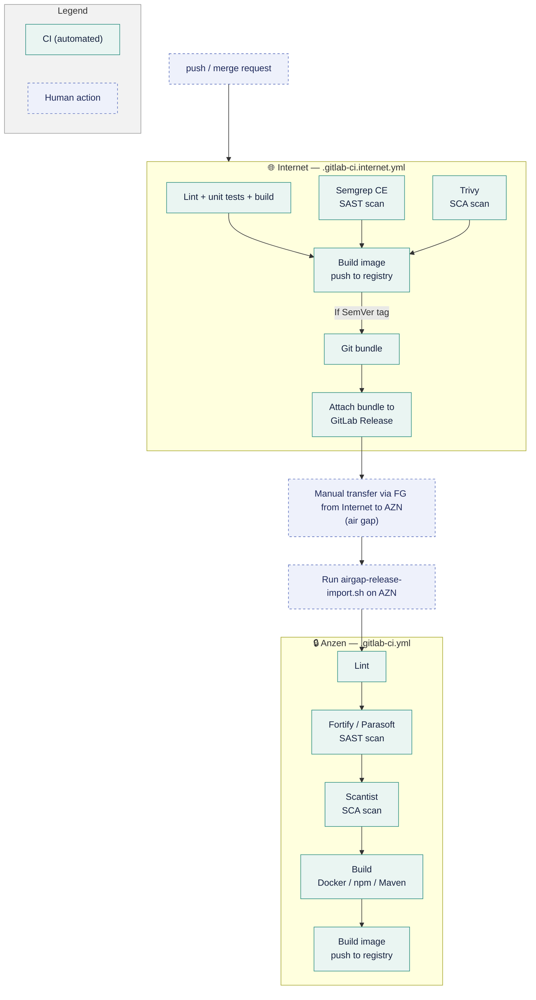

# Internet–AZN Git Sync

*Correct as of 22 September 2026*

---

## 1. Version Control & Security Scanning: AZN vs Internet

Scanning on Internet runs on free/OSS substitutes in place of AZN's paid enterprise stack.

| Area | AZN (On-Prem) | Internet | 
| --- | --- | --- | 
| Version control | GitLab Premium | GitLab Free* | 
| Lint (frontend) | ESLint | ESLint | 
| SAST | Fortify, Parasoft | Semgrep CE | 
| SCA | Scantist | Trivy | 
| Artifact / container registry | JFrog | GitLab Package/Container Registry | 

*capped at 5 seats, in midst of migrating to github

**What Lint, SAST and SCA are:**
- **Lint (ESLint)** checks code style and structure — catching formatting issues, unused variables, and common bug patterns — as source code is written. It's a code-quality check, not a security scan, and runs alongside SAST/SCA in CI.
- **SAST (Static Application Security Testing)** scans your own source code — without running it — to catch security bugs like injection flaws, hardcoded secrets, or unsafe API usage before the code ships.
- **SCA (Software Composition Analysis)** scans your third-party dependencies (npm/Maven packages, base images, etc.) against known vulnerability databases (CVEs) to catch risky or outdated libraries you've pulled in.

---
 
## 2. Synchronization Methodology & Workflow

> [!NOTE] Core strategy: one-way downstream sync only (Internet → AZN)
> - Code is developed and reviewed on Internet, then pulled into AZN at release time. 
> - No reverse sync exists — AZN never pushes code back to Internet.
 
Each repo now carries **two CI config files**: `.gitlab-ci.internet.yml` (runs on Internet, online) and `.gitlab-ci.yml` (runs on AZN, offline).
 


 
**What `airgap-release-import.sh` does:** 
- verifies the bundle, commit, and tag validity
- merges and fast-forwards the validated release into the AZN repository
- **It is repo-agnostic.** There is one copy, in `webcore-compose/scripts/`.
  ```
  airgap-release-import.sh -C ~/repos/<any-repo> release-1.2.0.bundle
  ```
     - The one fixed assumption is the tag pattern `^v?[0-9]+\.[0-9]+\.[0-9]+$`, which matches the pattern the release job uses. Releases must stay on plain SemVer tags for the import to work.
 
### Why the Git Trees between Internet and AZN Look Different
 
Internet carries full branch history. AZN stays a linear, read-only mirror advanced only by verified fast-forward merges.
 
**Internet — full branching:**
```
main
├── feature/*        (active dev)
├── release/v1.4     (release prep)
└── tags: v1.4.0     (triggers release-bundle)
```
 
**AZN — linear mirror only:**
```
main
└── fast-forward only
      (no feature branches,
       no local commits)
```
 
AZN only ever receives fast-forwarded commits from a verified bundle — it never grows its own branches. Internet keeps the full feature/release model needed for day-to-day development and review.
 
---
 
## 3. Current Status
 
GC3 is currently developing on internet.


