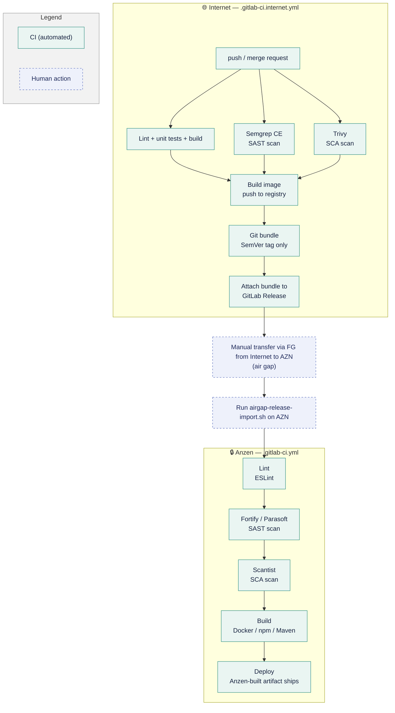

# Internet–AZN Git Sync

*Correct as of 20 September 2026*


---

## 1. Version Control & Security Scanning: AZN vs Internet

Scanning on Internet runs on free/OSS substitutes in place of AZN's paid enterprise stack.

| Area | AZN (On-Prem) | Internet | 
| --- | --- | --- | 
| Version control | GitLab Premium | GitLab Free* | 
| Lint | ESLint | ESLint | 
| SAST | Fortify, Parasoft | Semgrep CE | 
| SCA | Scantist | Trivy | 
| Artifact / container registry | JFrog | GitLab Package/Container Registry | 

*capped at 5 seats, alternatives being evaluated

**What Lint, SAST and SCA are:**
- **Lint (ESLint)** checks code style and structure — catching formatting issues, unused variables, and common bug patterns — as source code is written. It's a code-quality check, not a security scan, and runs alongside SAST/SCA in CI.
- **SAST (Static Application Security Testing)** scans your own source code — without running it — to catch security bugs like injection flaws, hardcoded secrets, or unsafe API usage before the code ships.
- **SCA (Software Composition Analysis)** scans your third-party dependencies (npm/Maven packages, base images, etc.) against known vulnerability databases (CVEs) to catch risky or outdated libraries you've pulled in.

Gating differs by stack, and the difference is deliberate. The five MFE pipelines are advisory: `semgrep ci … || true` plus `allow_failure: true`, and Trivy runs with no `--exit-code`, so findings reach the artifacts and never fail a job. The eight backend pipelines already gate, with no `allow_failure` anywhere — Semgrep fails on any ERROR-severity finding, and Trivy fails on HIGH or CRITICAL in the fat jar, the config tree, the secret scan and the freshly built image. Each Trivy step runs twice, `--exit-code 0` to write the JSON artifact and `--exit-code 1` to gate, so the evidence survives the failure. `.trivyignore` carries the accepted exceptions.

---
 
## 2. Synchronization Methodology & Workflow

> [!NOTE] Core strategy: one-way downstream sync only (Internet → AZN)
> - Code is developed and reviewed on Internet, then pulled into AZN at release time. 
> - No reverse sync exists — AZN never pushes code back to Internet.
 
Each repo now carries **two CI config files**: `.gitlab-ci.internet.yml` (runs on Internet, online) and `.gitlab-ci.yml` (runs on AZN, offline).
 



The lint/test and the two scans share the first stage and run in parallel — the image build waits for all three.

**Neither stack builds inside its Dockerfile.** Both compile in the pipeline and hand the result to the image as an artifact: the MFEs run `NODE_ENV=production npm run build` in `eslint-and-test` and the Dockerfile only does `COPY ./dist`, while the services run Gradle in `build-jar` and the Dockerfile only copies `build/libs/<service>-<version>.jar`. The artifact is therefore scannable before the image exists, which is what lets `build-image` gate on it. The bundle job runs only on a SemVer tag whose commit is on the default branch.
 
Job names differ by stack. Frontend: `eslint-and-test`, `semgrep-sast`, `trivy-sca`, `build-image`, `release-bundle`, `release`. Backend: `build-jar`, `build-image`, `sast-semgrep`, `sca-deps`, `sca-config`, `sca-secret` — no bundle job yet. The three shared Java libraries are a third shape again: they include an Internet-hosted template and get `gradle-build`, `gradle-release`, `check-release-tag`, `release-bundle` and `release`.
 
**What `airgap-release-import.sh` does:** 
- verifies the bundle, commit, and tag validity
- merges and fast-forwards the validated release into the AZN repository 
 
**It is repo-agnostic.** There is one copy, in `webcore-compose/scripts/`, and no repo needs its own config — it reads no config file, no `.env` and no environment variable. The target clone is an argument, the remote defaults to `origin`, and the default branch is auto-detected:
 
```
airgap-release-import.sh -C ~/repos/<any-repo> release-1.2.0.bundle
```
 
The one fixed assumption is the tag pattern `^v?[0-9]+\.[0-9]+\.[0-9]+$`, which matches the pattern the release job uses. Releases must stay on plain SemVer tags for the import to work.
 
### Why the Git Trees Look Different
 
Internet carries full branch history. AZN stays a linear, read-only mirror advanced only by verified fast-forward merges.
 
**Internet — full branching:**
```
main
├── feature/*        (active dev)
├── release/v1.4     (release prep)
└── tags: v1.4.0     (triggers release-bundle)
```
 
**AZN — linear mirror only:**
```
main
└── fast-forward only
      (no feature branches,
       no local commits)
```
 
AZN only ever receives fast-forwarded commits from a verified bundle — it never grows its own branches. Internet keeps the full feature/release model needed for day-to-day development and review.
 
### Final Release Process
 
Versioning is decided on Internet (git tag `v*`) — the artifact that actually ships is always the one rebuilt fresh on AZN, never the one built during Internet CI.
 
Releases use **`commit-and-tag-version`**, not `standard-version`. Both Node and Java repos use it:
 
```
npx commit-and-tag-version                                  # Node repos
npx commit-and-tag-version --packageFiles build.gradle      # Java repos
```
 
 
---
 
## 3. Migration & Run-Config Differences Required
 
Internet-side repos need environment-specific tweaks so builds don't depend on AZN-only infrastructure.
 
| Area | Internet-side change | Why |
| --- | --- | --- |
| CI pipeline config | Separate `.gitlab-ci.internet.yml`. The 13 application repos make it self-contained; the 3 shared libraries instead include an Internet-hosted template, `dsta-webcore/ci-templates` at ref `main-inet` | AZN's `webcore/ci-templates` cannot resolve outside the internal network |
| Backend (`build.gradle` / Testcontainers) | `build.gradle` is **not** edited — an `internet-init.gradle` init-script reroutes resolution; tests run with `-x test` | Testcontainers needs a privileged Docker daemon the Internet runner's socket-binding executor cannot start |
| Docker / docker-compose | Internal registry hostnames replaced or parameterized via `.env` toggles in `webcore-compose` | Internet runners can't resolve internal DNS (`jfrog.dev.saf`) |
| Frontend (`.npmrc` / `package-lock.json`) | `resolved` URLs stripped from the committed lockfile by a pre-commit hook | One lockfile resolves against either registry; a host-only rewrite fails because the internal registry adds a path segment |
 
**Where to see the changes themselves:** every migrated repo carries the work as its first merge request, `!1 Internet CI migration`, so a team can read the diff rather than the description. Two repos are exceptions: `map-overlay`, whose `!1` is a proprietary-dependency removal, and `baseline-single-spa-essentials`, which went straight to `main`.

**Where the migration guides are:** all three live in [`webcore-compose/docs/`](https://gitlab.com/dsta-webcore/webcore-compose/-/tree/main/docs) — [`getting-started.md`](https://gitlab.com/dsta-webcore/webcore-compose/-/blob/main/docs/getting-started.md) (Internet-side setup for npm, Gradle and compose), [`airgap.md`](https://gitlab.com/dsta-webcore/webcore-compose/-/blob/main/docs/airgap.md) (the air-gap side and the carry-across) and [`troubleshooting.md`](https://gitlab.com/dsta-webcore/webcore-compose/-/blob/main/docs/troubleshooting.md) (symptom → fix). `dsta-webcore` is a private group, so these open for members only.
 
- **`.npmrc` / `package-lock.json`** — the committed lockfile has its `resolved` URLs stripped, so `npm ci` rebuilds each URL from whichever registry is configured and one lockfile works in both worlds. A host-only rewrite does not work, because the internal registry embeds an extra path segment. Enforced by `npm run lock:normalize` and a pre-commit hook in each frontend repo. Guide: [How packages resolve](https://gitlab.com/dsta-webcore/webcore-compose/-/blob/main/docs/getting-started.md#how-packages-resolve).
- **`build.gradle`** — never edited. A Gradle init-script, `internet-init.gradle`, reroutes dependency resolution at invocation time; the guide below carries the exact invocation. The committed wrapper keeps pointing at the internal registry, so air-gap builds keep working and the rewrite is never committed. Guide: [Backend services (Java/Gradle)](https://gitlab.com/dsta-webcore/webcore-compose/-/blob/main/docs/getting-started.md).
- **`docker-compose`** — three `.env` variables switch registries: `WEBCORE_REGISTRY`, `COTS_REGISTRY` and `EJABBERD_REPO`. The first two are prefixes in front of a fixed image path, because `nginx` is `nginx` in both worlds. ejabberd is not: Docker Hub publishes it as `ejabberd/ecs` and the air-gap mirror holds it as `ejabberd/ejabberd`, so no prefix produces both and the whole `repo:tag` has to be the variable. Change only the two registry variables and that one container alone fails to pull. A second trap sits beside it: `COTS_REGISTRY` is read as `${COTS_REGISTRY-default}`, one dash, which substitutes only when the variable is **unset** — an empty value must stay empty to reach Docker Hub. Guide: [The three overrides](https://gitlab.com/dsta-webcore/webcore-compose/-/blob/main/docs/airgap.md#the-three-overrides).
 
---
 
## 4. Current Progress
 
GC3 develops on Internet. Pushing to a migrated repo runs the Internet pipeline's lint, test, SAST, SCA and image jobs. Local builds take the same route as CI: the `internet-init.gradle` init-script points dependency resolution at Maven Central and the group Maven registry, using a Deploy Token or PAT with `read_package_registry` where CI uses its job token. One repo is outstanding, `webcore-kafka-example`.

Building on Internet and shipping to AZN are separate capabilities, so they are counted separately.

| Category | Dev on Internet | Ships to AZN | Notes |
| --- | --- | --- | --- |
| Frontend / MFEs | 5 of 5 | 5 of 5 | `baseline-single-spa-assets` is excluded: it has no pipeline on either side, so there is nothing to migrate |
| Backend microservices | 7 of 8 | 0 of 8 | `webcore-kafka-example` is the one outstanding: it still runs the AZN `.gitlab-ci.yml` and has no Internet pipeline. |
| Shared Java libraries | 3 of 3 | 1 of 3 | All three build and publish to the Internet Maven registry. Only `webcore-common-utils-servlet` has a release with a bundle attached; `webcore-common-utils-core` and `webcore-test-utils` were last tagged 16 Sep, before the template gained its release jobs |
| Infra & internal tooling | 1 of 1 | 1 of 1 | All migrated |

Release-to-AZN bundling is live for the MFEs, infra tooling and one of the three shared libraries. The eight backend services are the gap: none has a `release-bundle` job, so none can cross the air gap yet.

`cet-service` is retired and heading for an archived subgroup, so it is not counted.

Pipeline status on 21 September 2026: green everywhere except `map-overlay`, where `build-image` fails while `build-jar` and all four scan jobs pass, and `baseline-single-spa-examples` on `main`.
